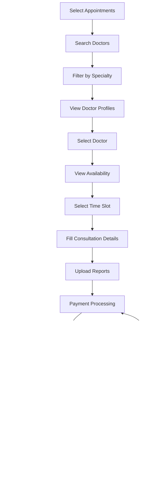

# JeewanJyoti Care - Visual Documentation & Charts

## Table of Contents
1. [System Architecture Diagram](#system-architecture-diagram)
2. [User Flow Charts](#user-flow-charts)
3. [Data Flow Diagrams](#data-flow-diagrams)
4. [Component Architecture](#component-architecture)
5. [Database Schema](#database-schema)
6. [API Endpoints Structure](#api-endpoints-structure)
7. [Security Architecture](#security-architecture)
8. [Deployment Architecture](#deployment-architecture)

---

## System Architecture Diagram


---

## User Flow Charts

### Registration Flow


### Login Flow


### Appointment Booking Flow



---

## Data Flow Diagrams

### Health Data Collection Flow


### Chat Message Flow


---

## Component Architecture

### React Component Hierarchy


### Component Dependencies


---

## Database Schema

### User Management Schema


### Health Data Schema


### Appointment System Schema


---

## API Endpoints Structure

### Authentication Endpoints


### Health Data Endpoints

```mermaid
flowchart TD
    A[Health Data API] --> B[GET /api/health-data/]
    A --> C[POST /api/health-data/]
    A --> D[GET /api/health-data/{id}/]
    A --> E[PUT /api/health-data/{id}/]
    A --> F[DELETE /api/health-data/{id}/]
    
    A --> G[GET /api/sleep-data/]
    A --> H[POST /api/sleep-data/]
    A --> I[GET /api/heart-rate/]
    A --> J[POST /api/heart-rate/]
    A --> K[GET /api/spo2-data/]
    A --> L[POST /api/spo2-data/]
    
    B --> M[Get All Health Data]
    C --> N[Create Health Data]
    D --> O[Get Specific Health Data]
    E --> P[Update Health Data]
    F --> Q[Delete Health Data]
```

### Appointment Endpoints

```mermaid
flowchart TD
    A[Appointment API] --> B[GET /api/doctors/]
    A --> C[GET /api/doctors/{id}/]
    A --> D[GET /api/appointments/]
    A --> E[POST /api/appointments/]
    A --> F[GET /api/appointments/{id}/]
    A --> G[PUT /api/appointments/{id}/]
    A --> H[DELETE /api/appointments/{id}/]
    
    A --> I[GET /api/doctor-availability/]
    A --> J[POST /api/doctor-availability/]
    A --> K[GET /api/available-slots/]
    
    B --> L[List All Doctors]
    C --> M[Get Doctor Details]
    D --> N[Get User Appointments]
    E --> O[Book Appointment]
    F --> P[Get Appointment Details]
    G --> Q[Update Appointment]
    H --> R[Cancel Appointment]
```

---

## Security Architecture

### Authentication & Authorization Flow


### Data Encryption Flow


---

## Deployment Architecture

### Production Deployment


### Development Environment


---

## Performance Metrics Dashboard

### System Performance Indicators


---

## Integration Points

### Third-Party Integrations


---

## Monitoring & Alerting

### System Monitoring Architecture

```mermaid
sequenceDiagram
    participant S as System
    participant M as Monitoring
    participant A as Alert Manager
    participant N as Notifications
    participant T as Team
    
    S->>M: Metrics Data
    M->>M: Process Metrics
    M->>A: Alert Conditions
    A->>A: Evaluate Rules
    A->>N: Trigger Alert
    N->>T: Send Notification
    T->>S: Investigate Issue
    T->>M: Check Dashboard
    S->>M: Resolution Data
```

---

## Data Analytics Pipeline

### Health Data Analytics

```mermaid
flowchart TD
    A[Raw Health Data] --> B[Data Validation]
    B --> C[Data Cleaning]
    C --> D[Data Transformation]
    D --> E[Feature Engineering]
    E --> F[Statistical Analysis]
    F --> G[Machine Learning Models]
    G --> H[Health Insights]
    H --> I[Recommendations]
    I --> J[User Dashboard]
    
    K[Historical Data] --> L[Trend Analysis]
    L --> M[Predictive Models]
    M --> N[Risk Assessment]
    N --> O[Early Warnings]
    O --> J
```

---

## Mobile App Architecture (Future)

### React Native Structure

```mermaid
graph TD
    A[React Native App] --> B[Navigation]
    A --> C[State Management]
    A --> D[API Integration]
    A --> E[Local Storage]
    
    B --> F[Stack Navigator]
    B --> G[Tab Navigator]
    B --> H[Modal Navigator]
    
    C --> I[Redux Store]
    C --> J[Middleware]
    C --> K[Reducers]
    
    D --> L[Axios Client]
    D --> M[Authentication]
    D --> N[Real-time Updates]
    
    E --> O[AsyncStorage]
    E --> P[SQLite]
    E --> Q[Secure Storage]
```

---

*This visual documentation complements the USER_MANUAL.md with detailed charts, diagrams, and architectural visualizations to help understand the system's technical implementation and user flows.*
